# Implementación del Sistema de Cambio de Perfiles

**Fecha**: 29 de enero de 2026
**Autor**: GitHub Copilot
**Relacionado con**: [019 - Problemas con la autenticación de perfil profesional y familiar](019%20-%20Problemas%20con%20la%20autenticación%20de%20perfil%20profesional%20y%20familiar.md)

## 📋 Resumen

Se ha implementado un sistema completo para que los usuarios puedan cambiar entre sus perfiles profesional y familiar desde la interfaz de usuario. El sistema incluye:

1. **Backend**: Endpoint para cambiar el rol activo y devolver el perfil correspondiente
2. **Frontend**: Servicio para comunicarse con el backend
3. **UI**: Lógica actualizada en los componentes de perfil para cargar datos de la BD

---

## 🎯 Objetivo

Permitir que un usuario autenticado pueda:
- Cambiar entre su perfil profesional y familiar mediante un botón en la UI
- Actualizar el rol activo en la tabla `user_roles` de la base de datos
- Cargar el perfil correspondiente si existe en la BD
- Crear el perfil si no existe
- Mantener sincronizado el estado del frontend con el backend

---

## 🔧 Implementación

### 1. Backend (API)

#### **Servicio**: `users.service.ts`

Se agregó el método `switchActiveRole()`:

```typescript
async switchActiveRole(
  userId: number,
  roleName: 'client' | 'provider',
): Promise<{
  activeRole: string;
  profile: any | null;
  profileType: 'client' | 'provider' | 'none';
}> {
  // 1. Obtener usuario con roles y perfiles
  const user = await this.userRepository.findOne({
    where: { id: userId },
    relations: ['roles', 'clientProfile', 'providerProfile'],
  });

  // 2. Buscar el rol solicitado
  const role = await this.roleRepository.findOne({
    where: { name: roleName },
  });

  // 3. Si no tiene el rol, asignarlo automáticamente
  if (!hasRole) {
    user.roles.push(role);
    await this.userRepository.save(user);
  }

  // 4. Retornar el perfil correspondiente
  return {
    activeRole: roleName,
    profile: roleName === 'client' ? user.clientProfile : user.providerProfile,
    profileType: profile ? roleName : 'none',
  };
}
```

**Características:**
- ✅ Verifica que el usuario existe
- ✅ Busca el nuevo rol solicitado (`client` o `provider`)
- ✅ **ELIMINA roles anteriores**: Elimina todos los roles client/provider previos
- ✅ **Asigna SOLO el nuevo rol**: El usuario solo tiene UN rol activo a la vez
- ✅ **NO permite múltiples roles**: Un usuario NO puede ser client y provider simultáneamente
- ✅ Devuelve el perfil correspondiente si existe
- ✅ Devuelve `null` si el perfil no existe (para que el frontend lo cree)
- ✅ **Protección a nivel de BD**: La tabla `user_roles` tiene PRIMARY KEY(user_id, role_id)

#### **Controlador**: `users.controller.ts`

Se agregó el endpoint `PATCH /users/:userId/active-role`:

```typescript
@Patch(':userId/active-role')
@ApiOperation({
  summary: 'Cambiar el rol activo del usuario',
  description: 'Cambia el rol activo del usuario entre cliente y proveedor...'
})
async switchActiveRole(
  @Param('userId', ParseIntPipe) userId: number,
  @Body() body: { roleName: 'client' | 'provider' },
) {
  return {
    message: 'Rol activo actualizado exitosamente',
    data: await this.usersService.switchActiveRole(userId, body.roleName),
  };
}
```

**Endpoint**: `PATCH /v1/users/{userId}/active-role`

**Request Body**:
```json
{
  "roleName": "client"  // o "provider"
}
```

**Response**:
```json
{
  "message": "Rol activo actualizado exitosamente",
  "data": {
    "activeRole": "client",
    "profile": {
      "id": 1,
      "firstName": "Juan",
      "lastName": "Pérez",
      // ... resto del perfil
    },
    "profileType": "client"  // o "none" si no existe el perfil
  }
}
```

---

### 2. Frontend (React)

#### **Servicio**: `authService.ts`

Se agregó el método `switchActiveRole()`:

```typescript
switchActiveRole: async (
  userId: number, 
  roleName: 'client' | 'provider'
): Promise<{
  activeRole: string;
  profile: any | null;
  profileType: 'client' | 'provider' | 'none';
}> => {
  const response = await fetchWithAuth(
    `${API_URL}/${API_VERSION}/users/${userId}/active-role`,
    {
      method: 'PATCH',
      headers: { 'Content-Type': 'application/json' },
      body: JSON.stringify({ roleName }),
    }
  );

  const result = await response.json();
  
  // Actualizar rol en localStorage
  tokenStorage.setUserRole(roleName as UserRole);
  
  return result.data;
}
```

**Características:**
- ✅ Llama al endpoint del backend
- ✅ Maneja renovación automática de tokens si expiran
- ✅ Actualiza el rol activo en localStorage
- ✅ Devuelve la respuesta del backend

#### **Componente**: `App.tsx`

Se actualizó la lógica de los botones "Cambiar a perfil...":

##### **Cambio a Perfil Familiar** (`onSwitchToClient`)

```typescript
onSwitchToClient={async () => {
  try {
    const user = tokenStorage.getUser();
    
    // 1. Llamar al backend para cambiar el rol activo
    const result = await authService.switchActiveRole(user.id, 'client');
    
    // 2. Actualizar el rol activo en el estado
    setActiveRole('client');
    
    // 3. Si existe el perfil en la BD, cargarlo
    if (result.profile) {
      const mappedProfile: ClientProfile = {
        id: result.profile.id,
        firstName: result.profile.user?.firstName || user.firstName,
        lastName: result.profile.user?.lastName || user.lastName,
        // ... mapear resto de campos
      };
      setClientProfile(mappedProfile);
    } else {
      // Si no existe el perfil, redirigir a la creación
      setView('familiarRegistration');
    }
  } catch (error) {
    console.error('Error al cambiar a perfil familiar:', error);
    // En caso de error, mantener perfil temporal
  }
}}
```

##### **Cambio a Perfil Profesional** (`onSwitchToProvider`)

```typescript
onSwitchToProvider={async () => {
  try {
    const user = tokenStorage.getUser();
    
    // 1. Llamar al backend para cambiar el rol activo
    const result = await authService.switchActiveRole(user.id, 'provider');
    
    // 2. Actualizar el rol activo
    setActiveRole('provider');
    
    // 3. Si existe el perfil, cargarlo (incluyendo servicios)
    if (result.profile) {
      // Cargar servicios del proveedor
      const servicesResponse = await serviceConfigService.getByProviderId(result.profile.id);
      
      // Mapear perfil con servicios
      const mappedProfile: ProviderProfile = {
        id: result.profile.id,
        // ... mapear campos
        services: servicesMap
      };
      setProviderProfile(mappedProfile);
    } else {
      // Si no existe, redirigir a creación
      setView('profesionalRegistration');
    }
  } catch (error) {
    console.error('Error al cambiar a perfil profesional:', error);
  }
}}
```

---

## �️ Prevención de Duplicados en user_roles

### ¿Cómo se evitan los duplicados?

El sistema tiene **múltiples capas de protección** para evitar registros duplicados:

#### 1. **Clave Primaria Compuesta en BD**
```sql
PRIMARY KEY (user_id, role_id)
```
- MySQL **no permite** insertar la misma combinación de user_id + role_id dos veces
- Si se intenta, la BD rechaza la operación con error

#### 2. **Verificación en el Código**
```typescript
// Verifica si el usuario ya tiene el rol
const hasRole = user.roles.some(
  (userRole) => userRole.id === role.id || userRole.name === roleName,
);

// Solo asigna si NO lo tiene
if (!hasRole) {
  user.roles.push(role);
  await this.userRepository.save(user);
}
```

#### 3. **TypeORM Maneja la Relación**
- TypeORM detecta que `user.roles` es una relación `@ManyToMany`
- Al hacer `save()`, TypeORM verifica qué relaciones ya existen
- Solo inserta las nuevas relaciones

### Logs de Verificación

Cuando cambias de perfil, verás en la consola del backend:

```bash
# Si NO tiene el rol (lo asigna):
✅ Asignando rol "provider" al usuario 33 (no lo tenía)

# Si YA tiene el rol (no hace nada):
ℹ️ Usuario 33 ya tiene el rol "provider" - NO se crea duplicado
```

### Verificar en Base de Datos

Usa el script SQL incluido para verificar que no hay duplicados:

```bash
cd cuidamet-api
docker compose exec mysql mysql -u root -p[PASSWORD] cuidamet < test\ endpoints\ with\ REST\ CLIENT\ extension/verify-no-duplicates.sql
```

O ejecuta manualmente en phpMyAdmin:

```sql
-- Buscar duplicados (debería devolver 0 filas)
SELECT user_id, role_id, COUNT(*) as count 
FROM user_roles 
GROUP BY user_id, role_id 
HAVING count > 1;
```

---

## �🔄 Flujo de Cambio de Perfil

### Escenario 1: Usuario cambiando de perfil existente


**Cambio en la BD:**
```sql
-- ANTES del cambio
user_roles: user_id=33, role_id=5 (client)

-- DESPUÉS del cambio
user_roles: user_id=33, role_id=4 (provider)
```

### Escenario 2: Usuario sin el perfil al que cambia

```mermaid
sequenceDiagram
    participant U as Usuario
    participant UI as Frontend
    participant API as Backend
    participant DB as Base de Datos
    
    U->>UI: Click "Cambiar a perfil familiar"
    UI->>API: PATCH /users/{id}/active-role {roleName: "client"}
    API->>DB: Verificar usuario y roles actuales
    API->>DB: ELIMINAR rol anterior (provider)
    API->>DB: INSERTAR nuevo rol (client)
    API->>DB: Buscar clientProfile
    Note over DB: clientProfile NO existe
    API-->>UI: {activeRole: "client", profile: null, profileType: "none"}
    UI->>UI: setActiveRole("client")
    UI->>UI: setView("familiarRegistration")
    UI-->>U: Muestra formulario de creación de perfil familiar
```



**Cambio en la BD:**
```sql
-- ANTES del cambio
user_roles: user_id=33, role_id=4 (provider)

-- DESPUÉS del cambio
user_roles: user_id=33, role_id=5 (client)
-- El perfil NO existe, frontend redirige a creación
```

---

## 📊 Tabla de Roles en BD

La tabla `user_roles` relaciona usuarios con su rol activo:

| user_id | role_id |
|---------|---------|
| 1       | 1       |
| 33      | 4       |
| 34      | 5       |

**Roles:**
- `1` = `admin`
- `2` = `user`
- `4` = `provider`
- `5` = `client`

**Regla CRÍTICA: Un usuario = Un rol**
- Cada usuario tiene **SOLO 1 registro** en `user_roles`
- Cuando cambia de perfil, se **ELIMINA** el registro anterior
- Se **CREA** un nuevo registro con el nuevo rol

**Ejemplo de cambio:**
```sql
-- ANTES: Usuario 33 es provider
SELECT * FROM user_roles WHERE user_id = 33;
-- Resultado: user_id=33, role_id=4

-- Usuario cambia a client
-- El sistema ejecuta:
DELETE FROM user_roles WHERE user_id = 33 AND role_id = 4;
INSERT INTO user_roles (user_id, role_id) VALUES (33, 5);

-- DESPUÉS: Usuario 33 es client
SELECT * FROM user_roles WHERE user_id = 33;
-- Resultado: user_id=33, role_id=5
```

---

## ✅ Beneficios de la Implementación

1. **Sincronización BD-Frontend**: Los cambios de perfil se guardan en la base de datos
2. **Persistencia**: Si el usuario recarga la página, mantiene su rol activo
3. **Creación automática de roles**: Si un usuario no tiene un rol, se asigna automáticamente
4. **Carga de datos reales**: Se carga el perfil completo desde la BD, no datos temporales
5. **Manejo de errores**: Si falla la carga, se mantiene un perfil temporal para no romper la UI
6. **Navegación inteligente**: Si no existe el perfil, redirige a la creación automáticamente

---

## 🧪 Cómo Probar

### Caso 1: Usuario con perfil profesional existente

1. Autenticarse con un usuario que tenga perfil profesional
2. Ir a "Tu" en la barra de navegación
3. Pulsar "Cambiar a perfil familiar"
4. **Resultado esperado**:
   - Si tiene perfil familiar → Se muestra FamiliarProfilePage con datos de BD
   - Si NO tiene perfil familiar → Se muestra FamiliarRegistration

### Caso 2: Usuario con perfil familiar existente

1. Autenticarse con un usuario que tenga perfil familiar
2. Ir a "Tu" en la barra de navegación
3. Pulsar "Cambiar a perfil profesional"
4. **Resultado esperado**:
   - Si tiene perfil profesional → Se muestra ProfesionalProfilePage con datos de BD
   - Si NO tiene perfil profesional → Se muestra ProfesionalRegistration

### Verificar en la consola del navegador:

```javascript
// Logs esperados al cambiar de perfil:
🔄 Cambiando a perfil PROFESIONAL...
✅ Respuesta del backend: {activeRole: "provider", profile: {...}, profileType: "provider"}
📦 Cargando servicios del proveedor: 5
✅ Servicios cargados: [{...}]
📦 Servicios transformados: {ELDERLY: {...}, CHILDREN: {...}}
```

### Verificar en la base de datos:

```sql
-- Ver roles del usuario
SELECT u.id, u.email, r.name as role_name, ur.assigned_at
FROM users u
JOIN user_roles ur ON u.id = ur.user_id
JOIN roles r ON ur.role_id = r.id
WHERE u.id = 1;
```

---

## 🔍 Debugging

Si algo no funciona, revisar:

1. **Backend**: Logs del servidor NestJS
   ```bash
   # Ver logs del contenedor
   docker logs cuidamet-api
   ```

2. **Frontend**: Consola del navegador
   - Buscar mensajes de error `❌`
   - Verificar llamadas HTTP en Network tab

3. **Base de datos**: Comprobar que el rol está asignado
   ```sql
   SELECT * FROM user_roles WHERE user_id = ?;
   ```

---

## 📝 Notas Adicionales

- **Perfiles temporales**: Se mantienen como fallback en caso de error de red
- **Roles múltiples**: Un usuario puede tener ambos roles (`client` y `provider`) simultáneamente
- **Servicios**: Solo se cargan para perfiles profesionales (proveedores)
- **Redirección**: Si no existe el perfil, se redirige automáticamente al formulario de creación

---

## 🚀 Próximas Mejoras

- [ ] Agregar indicador de carga mientras se cambia de perfil
- [ ] Implementar caché para evitar recargas innecesarias
- [ ] Agregar confirmación antes de cambiar de perfil
- [ ] Persistir el rol activo en el token JWT para evitar llamadas extras
- [ ] Implementar soft delete de roles antiguos (si se requiere)

---

## 📚 Referencias

- **Backend Service**: [users.service.ts](../../../cuidamet-api/src/users/users.service.ts)
- **Backend Controller**: [users.controller.ts](../../../cuidamet-api/src/users/users.controller.ts)
- **Frontend Service**: [authService.ts](../../../services/authService.ts)
- **Frontend Component**: [App.tsx](../../../App.tsx)
- **Documentación AGENTS**: [AGENTS.md](../../../cuidamet-api/AGENTS.md)
