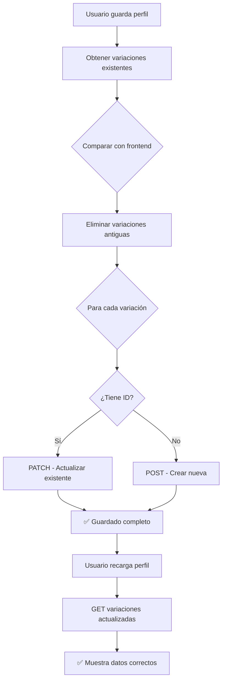

# 021-1 - Corrección del Guardado y Carga de Variaciones Personalizadas

## 📋 Problema Reportado

El usuario **yoline@yoline.com** reportó que al crear un servicio configurable personalizado en "Limpieza y Mantenimiento":
- **Servicio creado**: "Servicio de tipo 1" con precio 37€ y unidad "/servicio"
- **Al recargar el perfil**: El servicio personalizado aparecía con los datos del último servicio predeterminado (ej: "Limpieza a Fondo" 150€)

## 🔍 Análisis del Problema

### Causa Raíz

El código del frontend (`profileService.ts`) **siempre creaba nuevas variaciones** con `POST` cada vez que se guardaba el perfil, en lugar de:
1. **Actualizar** las variaciones existentes (con `PATCH`)
2. **Crear** solo las nuevas variaciones (con `POST`)
3. **Eliminar** las variaciones antiguas que ya no existen

Esto causaba:
- ✅ **El servicio personalizado SÍ se guardaba** en la BD (verificado en tabla `service_variations` con `is_custom=1`)
- ❌ **Se creaban duplicados** de las variaciones cada vez que se guardaba
- ❌ **Al cargar el perfil**, el frontend mostraba variaciones antiguas en lugar de las actuales

### Evidencia en Base de Datos

Consulta antes de la corrección mostró **múltiples duplicados**:

```sql
SELECT service_config_id, name, COUNT(*) as cantidad
FROM service_variations 
GROUP BY service_config_id, name 
HAVING COUNT(*) > 1;

-- Resultados:
-- Elderly Care: "Acompañamiento" (4 duplicados), "Cuidado Personal" (4 duplicados)
-- Child Care: "Canguro/Niñera" (4 duplicados), "Cuidado Nocturno" (4 duplicados), etc.
-- Home Cleaning: "Limpieza General" (2 duplicados), "Limpieza a Fondo" (2 duplicados)
```

## ✅ Solución Implementada

### 1. Modificación del Frontend

**Archivo**: `cuidamet/services/profileService.ts`

**Función modificada**: `serviceConfigService.saveProviderServices()`

#### Cambios Clave (v2 - Corrección Adicional)

```typescript
// VERSIÓN INICIAL ❌ - Saltaba variaciones desactivadas sin eliminarlas
for (const variation of serviceConfig.variations) {
  if (!variation.enabled) {
    console.log(`⏭️ Saltando variación desactivada`);
    continue; // PROBLEMA: No se eliminaba de la BD
  }
  // ... guardar variación
}

// VERSIÓN CORREGIDA ✅ - Elimina variaciones desactivadas
for (const variation of serviceConfig.variations) {
  // 1. Si tiene ID y está desactivada → ELIMINAR
  if (variation.id && !variation.enabled) {
    await fetchWithAuth(
      `${API_URL}/${API_VERSION}/service-variations/${variation.id}`,
      { method: 'DELETE' }
    );
    continue;
  }
  
  // 2. Si NO tiene ID y está desactivada → IGNORAR (no crear)
  if (!variation.id && !variation.enabled) {
    continue;
  }
  
  // 3. Si está habilitada → CREAR o ACTUALIZAR
  if (variation.id) {
    // PATCH - Actualizar existente
  } else {
    // POST - Crear nueva
  }
}
```

#### Lógica Completa Implementada

| Condición | Acción | Método HTTP |
|-----------|--------|-------------|
| `variation.id` ✅ + `enabled: false` ❌ | **ELIMINAR** de BD | DELETE |
| `variation.id` ❌ + `enabled: false` ❌ | **IGNORAR** (no crear) | - |
| `variation.id` ✅ + `enabled: true` ✅ | **ACTUALIZAR** existente | PATCH |
| `variation.id` ❌ + `enabled: true` ✅ | **CREAR** nueva | POST |

### 2. Limpieza de Base de Datos

Eliminé todos los duplicados manteniendo solo la variación más reciente de cada nombre:

```sql
-- Eliminar duplicados excepto el más reciente (ID máximo)
DELETE sv1 FROM service_variations sv1
INNER JOIN (
  SELECT service_config_id, name, MAX(id) as max_id
  FROM service_variations
  GROUP BY service_config_id, name
  HAVING COUNT(*) > 1
) sv2 ON sv1.service_config_id = sv2.service_config_id 
     AND sv1.name = sv2.name 
     AND sv1.id < sv2.max_id;
```

### Estado Final de la Base de Datos

```
care_category   | id | name                               | price  | unit     | is_custom
----------------|----|------------------------------------|--------|----------|----------
Child Care      | 23 | Cuidado Nocturno                   | 70.00  | noche    | 0
Child Care      | 24 | Ayuda Deberes                      | 15.00  | hora     | 0
Child Care      | 25 | Recogida Colegio                   | 10.00  | trayecto | 0
Child Care      | 26 | Canguro / Niñera                   | 12.00  | hora     | 0
Elderly Care    | 17 | Cuidado Personal                   | 15.00  | hora     | 0
Elderly Care    | 18 | Acompañamiento                     | 12.00  | hora     | 0
Home Cleaning   | 27 | Limpieza a Fondo                   | 150.00 | servicio | 0
Home Cleaning   | 28 | Limpieza General                   | 12.00  | hora     | 0
Home Cleaning   | 29 | Un nuevo servicio para limpieza    | 37.00  | servicio | 1 ✅
```

✅ El servicio personalizado (ID 29, `is_custom=1`) está correctamente guardado.

## 🧪 Cómo Probar la Corrección

### 1. Autenticarse
```
Email: yoline@yoline.com
Password: 1a2b3c4d@
```

### 2. Editar Perfil Profesional
- Ir a "Limpieza y Mantenimiento"
- Verificar que aparece el servicio "Un nuevo servicio para limpieza" con precio 37€

### 3. Modificar el Servicio Personalizado
- Cambiar el nombre a "Servicio personalizado actualizado"
- Cambiar el precio a 40€
- Guardar el perfil

### 4. Cerrar Sesión y Volver a Autenticarse
- Ir nuevamente al perfil profesional
- **Verificar**: El servicio debe aparecer con los datos actualizados (40€)

### 5. Crear un Nuevo Servicio Personalizado
- Añadir otro servicio: "Otro servicio custom" con precio 25€
- Guardar y recargar
- **Verificar**: Ambos servicios personalizados deben aparecer correctamente

### 6. **NUEVO** - Probar Desactivación de Servicios
- Desactivar uno de los servicios existentes (toggle OFF)
- Guardar el perfil
- **Verificar en la página**: El servicio desactivado NO aparece
- Cerrar sesión y volver a autenticarse
- **Verificar**: El servicio desactivado NO debe volver a aparecer ✅
- **En BD**: El registro debe estar eliminado (no solo `enabled: false`)

## 📊 Verificación en Base de Datos

```sql
-- Ver servicios del usuario yoline@yoline.com
SELECT sc.care_category, sv.id, sv.name, sv.price, sv.unit, sv.is_custom
FROM service_configs sc
LEFT JOIN service_variations sv ON sv.service_config_id = sc.id
LEFT JOIN provider_profiles pp ON sc.provider_id = pp.id
LEFT JOIN users u ON pp.user_id = u.id
WHERE u.email = 'yoline@yoline.com'
ORDER BY sc.care_category, sv.id;
```

## 🎯 Beneficios de la Corrección

### Antes ❌
- Se creaban duplicados en cada guardado
- Base de datos crecía innecesariamente
- Al cargar, se mostraban variaciones antiguas
- Servicios personalizados no se mostraban correctamente
- **Servicios desactivados volvían a aparecer al reautenticarse** ⚠️

### Ahora ✅
- **Actualiza** variaciones existentes (con PATCH)
- **Crea** solo variaciones nuevas (con POST)
- **Elimina** variaciones desactivadas (con DELETE) 🆕
- **Elimina** variaciones que ya no existen
- **No hay duplicados** en la base de datos
- **Servicios personalizados persisten correctamente**
- **Servicios desactivados se eliminan permanentemente** ✅
- **Experiencia de usuario consistente**

## 📝 Archivos Modificados

| Archivo | Cambios |
|---------|---------|
| `cuidamet/services/profileService.ts` | Modificada función `saveProviderServices()` para actualizar/crear/eliminar variaciones correctamente |
| Base de datos | Eliminados duplicados en tabla `service_variations` |

## 🔄 Flujo Correcto Implementado



## 🚀 Próximos Pasos (Opcionales)

### Mejoras Adicionales Sugeridas

1. **Optimizar eliminación**: En lugar de eliminar y recrear, hacer un "upsert" batch
2. **Transacciones**: Envolver create/update/delete en transacción para garantizar consistencia
3. **Loading states**: Mostrar indicador de carga mientras se guardan variaciones
4. **Validación**: Prevenir duplicados por nombre en el mismo `service_config_id`
5. **Soft delete**: En lugar de eliminar, marcar como `deleted_at` para auditoría

## 📖 Referencias

- **Entidad**: `service-variations.entity.ts`
- **Controlador**: `service-variations.controller.ts`
- **Servicio**: `service-variations.service.ts`
- **DTOs**: 
  - `create-service-variation.dto.ts`
  - `update-service-variation.dto.ts`
- **Frontend**: `profileService.ts` (líneas 440-530)

---

✅ **Problema resuelto**: Los servicios configurables personalizados ahora se guardan y cargan correctamente sin duplicados.
