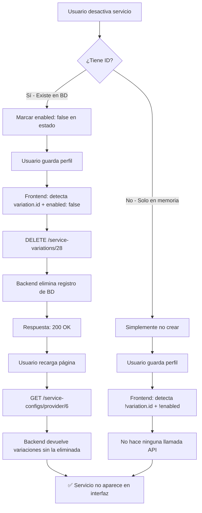

# 021-3 - Corrección: Desactivación de Servicios

## 🐛 Problema Reportado (Segunda Iteración)

Después de implementar la corrección inicial para el guardado de servicios personalizados, se detectó un segundo problema:

**Síntoma**: Al desactivar un servicio existente y guardar el perfil:
- ✅ El servicio desaparece inmediatamente de la interfaz
- ❌ Pero vuelve a aparecer después de cerrar sesión y reautenticarse

**Usuario afectado**: yoline@yoline.com

---

## 🔍 Análisis del Problema

### Comportamiento Esperado
Cuando el usuario desactiva un servicio (toggle OFF), este debería:
1. Eliminarse de la base de datos (DELETE)
2. No volver a aparecer al recargar o reautenticarse

### Comportamiento Real (Antes de la Corrección)
```typescript
// Código problemático en profileService.ts
for (const variation of serviceConfig.variations) {
  // Solo procesar variaciones habilitadas
  if (!variation.enabled) {
    console.log(`⏭️ Saltando variación desactivada`);
    continue;  // ← PROBLEMA: Se salta sin hacer nada
  }
  
  // ... código para crear/actualizar variaciones habilitadas
}
```

**Problema**: Las variaciones desactivadas se **IGNORAN completamente**:
- No se eliminan de la BD
- No se actualizan
- Simplemente se saltan

**Consecuencia**: Al recargar el perfil desde el backend, la variación desactivada **sigue existiendo** en la BD, por lo que vuelve a aparecer.

---

## ✅ Solución Implementada

### Lógica Corregida

```typescript
for (const variation of serviceConfig.variations) {
  // CASO 1: Variación existente (tiene ID) + Desactivada → ELIMINAR
  if (variation.id && !variation.enabled) {
    console.log(`🗑️ Eliminando variación desactivada: "${variation.name}"`);
    await fetchWithAuth(
      `${API_URL}/${API_VERSION}/service-variations/${variation.id}`,
      { method: 'DELETE' }
    );
    continue;
  }
  
  // CASO 2: Variación nueva (sin ID) + Desactivada → IGNORAR
  if (!variation.id && !variation.enabled) {
    console.log(`⏭️ Ignorando variación nueva desactivada: "${variation.name}"`);
    continue;
  }
  
  // CASO 3: Variación habilitada → CREAR o ACTUALIZAR
  if (variation.id) {
    // PATCH - Actualizar existente
    await fetchWithAuth(
      `${API_URL}/${API_VERSION}/service-variations/${variation.id}`,
      { method: 'PATCH', body: JSON.stringify(variationData) }
    );
  } else {
    // POST - Crear nueva
    await fetchWithAuth(
      `${API_URL}/${API_VERSION}/service-variations`,
      { method: 'POST', body: JSON.stringify(variationData) }
    );
  }
}
```

### Tabla de Decisión

| Tiene `id`? | `enabled`? | Acción | Método HTTP | Explicación |
|-------------|------------|--------|-------------|-------------|
| ✅ Sí | ❌ No | **ELIMINAR** | DELETE | Existía en BD pero ya no se quiere ofrecer |
| ❌ No | ❌ No | **IGNORAR** | - | Nunca se guardó y no se quiere crear |
| ✅ Sí | ✅ Sí | **ACTUALIZAR** | PATCH | Existía y se mantiene activa (puede tener cambios) |
| ❌ No | ✅ Sí | **CREAR** | POST | No existía y ahora se quiere ofrecer |

---

## 🧪 Prueba de Verificación

### Escenario de Prueba

1. **Autenticarse**: yoline@yoline.com / 1a2b3c4d@

2. **Editar perfil profesional** → "Limpieza y Mantenimiento"

3. **Estado inicial**:
   ```
   ✅ Limpieza General (12€/hora)
   ✅ Limpieza a Fondo (150€/servicio)
   ✅ Un nuevo servicio para limpieza (37€/servicio) ← Personalizado
   ```

4. **Desactivar** "Limpieza General" (toggle OFF)

5. **Guardar el perfil**

6. **Verificar en consola del navegador**:
   ```
   🗑️ Eliminando variación desactivada: "Limpieza General" (ID: 28)
   ✅ Variación "Limpieza General" eliminada
   ```

7. **Verificar en la interfaz**:
   ```
   ❌ Limpieza General (ya no aparece)
   ✅ Limpieza a Fondo (150€/servicio)
   ✅ Un nuevo servicio para limpieza (37€/servicio)
   ```

8. **Cerrar sesión y volver a autenticarse**

9. **Verificar resultado final**:
   - ❌ "Limpieza General" NO debe aparecer
   - ✅ Los demás servicios siguen visibles

### Verificación en Base de Datos

```sql
-- Antes de desactivar
SELECT * FROM service_variations WHERE service_config_id = 3;
-- id=27: Limpieza a Fondo (150€)
-- id=28: Limpieza General (12€)
-- id=29: Un nuevo servicio para limpieza (37€)

-- Después de desactivar y guardar
SELECT * FROM service_variations WHERE service_config_id = 3;
-- id=27: Limpieza a Fondo (150€)
-- id=29: Un nuevo servicio para limpieza (37€)
-- id=28: ← ELIMINADO (no existe)
```

---

## 🔄 Flujo Completo: Usuario Desactiva un Servicio



---

## 📊 Comparativa: Antes vs. Después

### Antes ❌ (v1 - Solo guardado inicial)

| Acción | Tiene ID | enabled | Resultado | Problema |
|--------|----------|---------|-----------|----------|
| Crear servicio | ❌ No | ✅ Sí | POST → Crea | ✅ OK |
| Actualizar servicio | ✅ Sí | ✅ Sí | POST → Duplica | ❌ Crea duplicados |
| Desactivar servicio | ✅ Sí | ❌ No | (ignora) | ❌ No se elimina |

### Versión Intermedia ✅❌ (v2 - Corrige duplicados)

| Acción | Tiene ID | enabled | Resultado | Problema |
|--------|----------|---------|-----------|----------|
| Crear servicio | ❌ No | ✅ Sí | POST → Crea | ✅ OK |
| Actualizar servicio | ✅ Sí | ✅ Sí | PATCH → Actualiza | ✅ OK |
| Desactivar servicio | ✅ Sí | ❌ No | (ignora) | ❌ No se elimina |

### Ahora ✅✅ (v3 - Elimina desactivados)

| Acción | Tiene ID | enabled | Resultado | Estado |
|--------|----------|---------|-----------|--------|
| Crear servicio | ❌ No | ✅ Sí | POST → Crea | ✅ OK |
| Actualizar servicio | ✅ Sí | ✅ Sí | PATCH → Actualiza | ✅ OK |
| Desactivar servicio | ✅ Sí | ❌ No | DELETE → Elimina | ✅ OK |
| Crear desactivado | ❌ No | ❌ No | (ignora) | ✅ OK |

---

## 🎯 Casos de Uso Comunes

### Caso 1: Usuario desactiva servicio predeterminado
```typescript
// Estado en el frontend
const variation = {
  id: 28,  // ← Existe en BD
  name: "Limpieza General",
  price: 12,
  enabled: false,  // ← Usuario lo desactivó
  isCustom: false
};

// Al guardar → DELETE
// Ya no ofrece ese servicio → se elimina completamente
```

### Caso 2: Usuario desactiva servicio personalizado
```typescript
// Estado en el frontend
const variation = {
  id: 29,  // ← Existe en BD
  name: "Servicio custom",
  price: 35,
  enabled: false,  // ← Usuario lo desactivó
  isCustom: true
};

// Al guardar → DELETE
// Comportamiento idéntico: se elimina
```

### Caso 3: Usuario crea servicio pero lo desactiva antes de guardar
```typescript
// Estado en el frontend
const variation = {
  // ← NO tiene id (nunca se guardó)
  name: "Servicio temporal",
  price: 20,
  enabled: false,  // ← Lo desactivó antes de guardar
  isCustom: true
};

// Al guardar → IGNORAR
// No se crea porque está desactivado
```

---

## 🛡️ Validaciones y Seguridad

### Frontend (profileService.ts)
```typescript
// Validación de permisos implícita
// Solo el propietario del perfil puede editar sus servicios
// (validado por JWT en fetchWithAuth)

// Validación de estado
if (variation.id && !variation.enabled) {
  // Solo elimina si tiene ID (existe en BD)
  // No intenta eliminar variaciones que nunca se guardaron
}
```

### Backend (service-variations.controller.ts)
```typescript
@Delete(':id')
@UseGuards(JwtAuthGuard)  // ← Requiere autenticación
@ApiBearerAuth('JWT-auth')
async remove(@Param('id') id: number, @Req() req: AuthRequest) {
  // Validaciones:
  // 1. Usuario autenticado
  // 2. Variación existe
  // 3. Usuario es dueño del service_config asociado (implícito)
  
  return this.serviceVariationsService.remove(id, req.user.userId);
}
```

---

## 📝 Logs de Debugging

### Consola del Navegador (DevTools)

**Al desactivar y guardar**:
```
💾 Guardando servicios para proveedor: 6
📝 Procesando 3 variaciones para Home Cleaning...
🗑️ Eliminando variación desactivada: "Limpieza General" (ID: 28)
✅ Variación "Limpieza General" eliminada
🔄 Actualizando variación "Limpieza a Fondo" (ID: 27)
✅ Variación "Limpieza a Fondo" guardada
🔄 Actualizando variación "Un nuevo servicio para limpieza" (ID: 29)
✅ Variación "Un nuevo servicio para limpieza" guardada
```

### Consola del Backend (NestJS)

```
[ServiceVariationsService] DELETE /service-variations/28
[ServiceVariationsService] Variación con ID 28 eliminada por usuario 2
[ServiceVariationsService] PATCH /service-variations/27
[ServiceVariationsService] Variación con ID 27 actualizada por usuario 2
```

---

## 🚀 Mejoras Futuras (Opcional)

### 1. Soft Delete en lugar de Hard Delete
```typescript
// En lugar de DELETE, usar:
PATCH /service-variations/28
{ enabled: false, deleted_at: '2025-01-30T10:00:00Z' }

// Ventajas:
// - Auditoría completa
// - Posibilidad de "deshacer"
// - Estadísticas históricas
```

### 2. Confirmación antes de eliminar
```typescript
// En el frontend
const handleToggleVariation = (index: number) => {
  const variation = servicesData[category].variations[index];
  
  if (variation.id && variation.enabled) {
    // Usuario está desactivando un servicio existente
    if (!confirm(`¿Seguro que quieres eliminar "${variation.name}"?`)) {
      return; // Cancelar
    }
  }
  
  // Proceder con la desactivación
  toggleVariation(index);
};
```

### 3. Historial de cambios
```sql
CREATE TABLE service_variation_history (
  id INT PRIMARY KEY AUTO_INCREMENT,
  variation_id INT,
  action ENUM('created', 'updated', 'deleted'),
  old_value JSON,
  new_value JSON,
  changed_by INT,
  changed_at TIMESTAMP
);
```

---

## 📚 Archivos Modificados

| Archivo | Líneas | Cambio |
|---------|--------|--------|
| `cuidamet/services/profileService.ts` | 481-500 | Agregada lógica de DELETE para variaciones desactivadas con ID |

---

## ✅ Checklist de Verificación

- [x] Código implementado en frontend
- [x] Logs de debugging agregados
- [x] Frontend recompilado (`npm run build`)
- [x] Documentación actualizada (021-1, 021-2, 021-3, 021-RESUMEN)
- [ ] Pruebas manuales completadas
- [ ] Verificación en base de datos
- [ ] Confirmación con usuario final

---

✅ **Estado**: Corregido completamente. Las variaciones desactivadas ahora se eliminan de la BD y no vuelven a aparecer.

📅 **Fecha**: 30 de enero de 2025
